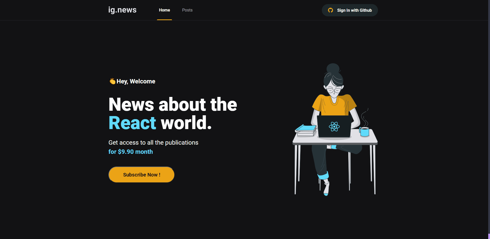

<h1 align="center">Ig.news 📰</h1>

<p align="center">
  
</p>

<p>Ignews é uma aplicação front-end desenvolvida em NextJS com TypeScript durante o módulo Chapter III do Ignite, bootcamp intensivo da Rocketseat, na trilha de ReactJS.</p>
<P>O objetivo da aplicação é apenas obter conhecimento à medida que avançamos no bootcamp. A aplicação foi desenvolvida durante as aulas do bootcamp e agrega conhecimentos diversos, dentre eles os fundamentos do NextJS, estruturação de um back-end dentro do front-end e o front-end JAMStack.</p>

<h2>🎯 Conhecimentos agregados</h2>

- [x]  Páginas estáticas no NextJS.
- [x]  Geração de sites estáticos dinâmicos.
- [x]  Revalidação de páginas estáticas para atualização de conteúdo.
- [x]  Server Side Rendering.
- [x]  Integração de CMS externos.
- [x]  SASS.
- [x]  CSS Modules.
- [x]  TypeScript.
- [x]  Prismic CMS.
- [x]  FaunaDB para banco de dados.
- [x]  Stripe integração de pagamentos.

<h2>⚒️ Como usar</h2>
<h3>Instalação</h3>
<p>Abra esse projeto no seu editor de código ou no terminal do seu computador e execute o comando abaixo.</p>

```sh
yarn
```

<h3>Rodando a aplicação</h3>
  <p>No terminal execute o comando abaixo.</p>

```sh
yarn dev
```

<p>A aplicação será aberta na porta:3000. No seu navegador acesse http://localhost:3000</p>

<h2 id="autor">🤵🏽 Autor</h2>

<h3>Desenvolvido com 💖 por João Vitor Mineiro durante bootcamp Ignite da Rocketseat 🚀 </h3>

* [Linkedin](https://www.linkedin.com/in/jvmineiro/)

  
<strong align="center">Se gostou, deixe sua ⭐️</strong>
